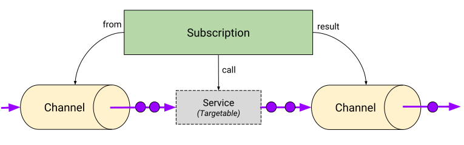
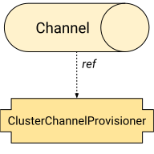

API定义并提供了 Subscription 的完整实现，还有 Channel 和 ClusterChannelProvisioner 的抽象资源定义，这些定义可以由多个后端实现来完成（非常类似于Kubernetes Ingress资源）。

将可扩展性和可组合性作为 Knative Eventing 的目标，eventing API 定义了几个资源，都可以简化为很好理解的契约。这些事件资源接口可以由其他Kubernetes对象实现，然后作为具体对象以相同的方式组合。接口是（Sinkable，Subscribable，Targetable）。 有关更多详细信息，请参阅接口契约。

- **Subscription** 描述了事件的转换和可选的返回事件的转发。
- **Channel** 提供事件持久性和事件扇出，从众所周知的输入地址到通过 _Subscriptions_ 描述的多个输出。

- **ClusterChannelProvisioners** 为后台资源实施了策略，用于当前事件系统中活动的Channel的不同实现。

源由可以安装到集群中的独立CRD定义。更多信息请查阅 [Knative Eventing Sources](https://github.com/knative/eventing-sources).

## Subscription

**Subscription** 描述了通过转换从一个Channel到下一个Channel的事件流（例如通过 HTTP 处理 CloudEvents 的 Knative Service）。Subscription controller 通过 Targetable 和 Sinkable 接口契约解析转换（`call`）的地址和目标存储（`result`），并将解析的地址写入`from`引用中的Channel。 Subscription 不需要同时指定转换和存储目标，但必须至少提供一个。

Subscription 中的所有事件传递链接都是1：1 - 只能提供单个`from`, `call`, 和 `result`。

## Channel

Channel 提供事件传递机制，可以通过 Subscription 将收到的事件扇出到多个目的地。Channel 具有单个入站 Sinkable 接口，可以接受直接传递的事件或从多个 Subscription 转发的事件。不同的 Channel 可以实现不同程度的持久性。 事件传递顺序取决于 ClusterChannelProvisioner 提供的 Channel 的后端实现。

Channel上的事件选择为1：N - 单个 Channel 可以扇出到多个 Subscription。

## ClusterChannelProvisioner

ClusterChannelProvisioner 为 Channel 的可用实现列出目录。ClusterChannelProvisioners拥有一个JSON Schema，用于验证Channel输入参数。ClusterChannelProvisioners可以为它们提供的 Channel 提供群集范围的默认值。

ClusterChannelProvisioners 不直接处理事件。 它们和Channe是1：N。

