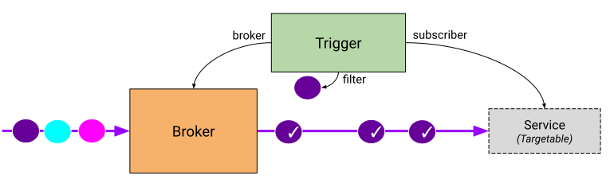

Knative Eventing是一个旨在解决云原生开发的共同需求的系统，提供可组合的原语，以实现事件源和事件消费者的后期绑定。

https://knative.dev/docs/eventing/

## 功能性

Knative Eventing支持多种使用模式。现有的组件可以很好的支持以下场景；因为系统是模块化的，所以也可以用新颖的方式组合组件。

1. **只想发布事件，不关心谁来消费它们**。将事件以 HTTP POST 的方式发送给Broker。SinkBinding可以有效地将目的地配置与应用程序解耦。

2. **只想消费像X这样的事件，不关心它们是如何发布的**。使用触发器（Trigger） 从基于CloudEvents属性的Broker消费事件。应用程序将以 HTTP POST 的方式接收事件。

3. **想通过一系列的步骤来转换事件**。使用 Channel 和 Subscriptions 来定义复杂的消息传递拓扑。对于简单的管道，Sequence可以在每个阶段之间自动构造Channel和Subscriptions。

Knative还支持一些额外的模式，如事件的并行扇出，以及从Channel和Brokers中路由响应事件。

## 设计概述

Knative Eventing围绕以下目标设计：

1. Knative Eventing服务是松散耦合的。这些服务可以在各种平台（例如Kubernetes、VM、SaaS或FaaS）上独立开发和部署。
2. 事件生产者和事件消费者是独立的。任何生产者（或源），都可以在有活跃的事件消费者监听之前生成事件。任何事件消费者都可以在有生产者创建这些事件之前，对某个事件或事件类别表示兴趣。
3. 其他服务可以连接到Eventing系统。这些服务可以执行以下功能：

	- 在不修改事件生产者或事件消费者的情况下，创建新的应用程序。
	- 从事件生产者中选择和锁定事件的特定子集。

4. 确保跨服务的互操作性。Knative Eventing 与 CNCF Serverless WG 开发的 CloudEvents 规范一致。

### 事件消费者

为了能够向多种类型的Service交付，Knative Eventing定义了两个通用接口，可以由多个Kubernetes资源实现。

1. **Addressable**：可寻址对象能够接收并确认通过HTTP传递到其 `status.address.url` 字段中定义的地址的事件。作为一种特殊情况，核心的Kubernetes Service 对象也能实现Addressable接口。
2. **Callable**: 可调用对象能够接收通过HTTP交付的事件，并对事件进行转换，在HTTP响应中返回0或1个新事件。这些返回的事件可以按照处理外部事件源事件的方式进一步处理。

### 事件中介和触发器

通过Broker和Trigger对象，可以根据事件属性轻松过滤事件。

Broker提供了一个事件桶/bucket，可以通过属性来选择。它接收事件并将它们转发到由一个或多个匹配的Trigger 定义的订阅者。由于 Broker 实现了 Addressable，事件发送者可以通过POST事件到Broker的 `status.address.url` 来提交事件到Broker。

Trigger 描述了基于事件属性的过滤器，这些属性应该被传递到Addressable。您可以根据需要创建任意多的 Trigger。

对于大多数用例，每个命名空间有一个桶/bucket（Broker）就足够了，但在一些服务器用例中，多个桶（Broker）可以简化架构。例如，为包含个人身份信息（Personally Identifiable Information/PII）的事件和非 PII 事件分别设立 Brokers 可以简化审计和访问控制规则。

### Event registry

Knative Eventing定义了一个EventType对象，使消费者更容易发现他们可以从Brokers消费的事件类型。

registry由事件类型的集合组成。存储在注册表中的事件类型包含了消费者创建触发器所需的（所有）信息，而无需求助于其他的带外机制。

### 简化事件投递

SinkBinding自定义对象支持将事件生产与投递寻址解耦。

当您创建SinkBinding时，您会引用一个Addressable和一个提供一个PodTemplateSpec的Kubernetes对象。SinkBinding会将环境变量（目标URL的$K_SINK）注入到PodTemplateSpec中，这样应用程序代码就不需要与Kubernetes API交互来定位事件目标。

### 事件通道和订阅

Knative Eventing还定义了一个事件转发和持久化层，称为Channel。每个通道是一个独立的Kubernetes CR 自定义资源。事件被投递给服务，或者使用Subscriptions转发到其他通道（可能是不同类型的）。这允许集群中的消息投递根据需求而变化，因此一些事件可能由内存实现处理，而其他事件将使用Apache Kafka或NATS Streaming进行持久化。

### 更高级别的事件构造

在有些情况下，你可能会想一起利用一组合作的函数，对于这些用例，Knative Eventing提供了两个额外的资源。

1. Sequence提供了定义按顺序排列的函数列表的方法。

2. Parallel提供了一种为事件定义分支列表的方法。

### 未来的设计目标

下一个Eventing版本的重点将是简化事件源的实现。Sources使用Kubernetes Custom Resources管理来自外部系统的事件注册和投递。

## Sources

每个Source都是一个独立的Kubernetes自定义资源。这允许每个类型的Source定义实例化一个source所需的参数。所有的Sources应该是 `sources` 类别的一部分，所以你可以用kubectl get sources列出所有现有的Sources。

除了下面解释的 source 外，还有其他 source 可以安装。

如果你的代码需要发送事件作为其业务逻辑的一部分，并且不符合Source的模式，可以考虑直接将事件馈送到Broker。

### core source

这些是安装Knative Eventing时开箱即用的 core source。

#### APIServerSource

每次创建、更新或删除Kubernetes资源时，APIServerSource都会触发一个新的事件。

#### PingSource

PingSource根据给定的Cron计划来发送事件。

#### Container Source

ContainerSource 将实例化容器镜像，该镜像可以生成事件，直到 ContainerSource 被删除。这可以用来（例如）轮询FTP服务器是否有新的文件或在设定的时间间隔内产生事件。

#### SinkBinding

SinkBinding可用于使用Kubernetes提供的任何熟悉的计算抽象（如Deployment、Job、DaemonSet、StatefulSet）或Knative抽象（如Service、Configuration）来编写新的事件源。

### Eventing Contrib Sources

这是一个由我们的社区支持的、维护在Knative Eventing-Contrib Github repo中的source的非详尽列表。

#### GitHub source

GitHubSource为选定的GitHub事件类型生成一个新事件。

#### GitLab源

GitLabSource为指定的事件类型创建一个webhooks，监听传入的事件，并将其传递给消费者。

#### AwsSqsSource

每当在AWS SQS topic上发布事件时，AwsSqsSource都会发射一个新事件。

#### KafkaSource

KafkaSource从Apache Kafka集群中读取事件，并将这些事件传递给Knative Serving应用，以便它们被消费。

#### CamelSource

CamelSource是一个事件源，它可以代表任何现有的Apache Camel组件，它提供了一个消费端，并能将事件发布到一个可寻址的端点。每个Camel端点都有一个URI的形式，其中scheme是要使用的组件的ID。

#### Google Cloud Sources

为了消费来自不同GCP服务的事件，Knative-GCP支持不同的GCP源。

##### CloudPubSubSource

每次在 Google Cloud Platform PubSub 主题上发布消息时，CloudPubSubSource 都会触发一个新事件。

##### CloudStorageSource

在指定的谷歌云存储桶和可选的对象前缀上注册特定类型的事件。将这些事件带入Knative。

##### CloudSchedulerSource

创建、更新和删除Google Cloud Scheduler Jobs。当这些作业被触发时，在Knative内部接收事件。

##### CloudAuditLogsSource

在指定的Google Cloud Audit Logs上注册特定类型的事件。将这些事件带入Knative。