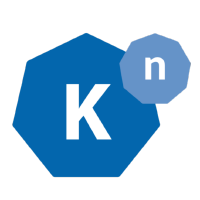

## 什么是knative？

[knative](https://github.com/knative) 是谷歌牵头的 serverless 架构方案，旨在提供一套简单易用的 serverless 开源方案，把 serverless 标准化和平台化。目前参与 knative 项目的公司主要有： Google、Pivotal、IBM、Red Hat和SAP。

这是 Google Cloud Platform 宣布 knative 时给出的介绍：

> Developed in close partnership with Pivotal, IBM, Red Hat, and SAP, Knative pushes Kubernetes-based computing forward by providing the building blocks you need to build and deploy modern, container-based serverless applications.
>
> 与Pivotal，IBM，Red Hat和SAP密切合作开发，通过提供构建和部署基于容器的现代serverless应用程序所需的构建块，Knative推动基于Kubernetes的计算。

在knative的github页面，Knative 给出的官方介绍如下：

>  Kubernetes-based platform to build, deploy, and manage modern serverless workloads.
>
>  基于Kubernetes的平台，用于构建，部署和管理现代serverless工作负载。

## knative项目进展

knative在2018年7月24日对外发布，当前还处于早期发展的阶段，各个版本间的变化也比较大。

- 2018-07-19 v0.1.0 版本发布
- 2018-10-31 v0.2.0 版本发布
- 2018-01-09 v0.3.0 版本发布
- 2019-02-20 v0.4.0 版本发布
- 2019-04-03 v0.5.0 版本发布

## Knative概述

> 以下内容翻译自：https://www.knative.dev/docs/

Knative扩展了Kubernetes，提供了一组中间件组件，这些组件对于构建可在任何地方运行的现代以源为中心和基于容器的应用程序至关重要：在本地，在云中，甚至在第三方数据中心。

Knative项目下的每个组件都尝试识别常见模式并编纂最佳实践，这些最佳实践被真实世界中基于Kubernetes的成功框架和应用程序共享。 Knative组件专注于解决许多平凡但困难的任务，例如：

- 部署容器
- 在Kubernetes上编排source-to-URL的工作流程
- 使用蓝绿部署路由和管理流量
- 根据需求自动收缩和调整工作负载大小
- 将运行服务绑定到事件生态系统

Knative的开发人员可以使用熟悉的习语，语言和框架来部署任何工作负载：函数，应用程序或容器。

### 组件

目前有以下Knative组件：

- Build - 源到容器的构建编排
- Eventing - 管理和交付事件
- Serving - 请求驱动的计算，可以扩展到零

### 受众

Knative的设计考虑了不同的角色：

- 开发人员

  Knative组件为开发人员提供Kubernetes原生API，用于将serverless风格的函数，应用程序和容器部署到自动伸缩运行时。

- 运维

  Knative组件旨在集成到更加优雅的产品中，云服务提供商或大型企业的内部团队可以随后运维。

  任何企业或云提供商都可以将Knative组件应用到他们自己的系统中，并将这些收益传递给他们的客户。

- 贡献者

  凭借明确的项目范围，轻量级治理模型以及可插拔组件之间简洁的分离线，Knative项目建立了高效的贡献者工作流程。

  Knative是一个多元化，开放和包容的社区。

## knative特性

> 以下内容翻译自：https://cloud.google.com/knative/

- 所有人必备的基本原语

  Knative提供了一组中间件组件，这些组件对于构建可在任何地方运行的现代，以源为中心和基于容器的应用程序至关重要：在本地，在云中，甚至在第三方数据中心。 Knative组件基于Kubernetes构建，并编写最佳实践，这些最佳实践被真实世界中基于Kubernetes的成功框架和应用程序共享。它使开发人员能够专注于编写有趣的代码，而无需担心构建，部署和管理应用程序的“枯燥但困难”的部分。

- 开发人员友好的软件

  Knative提供了一组可重用的组件，专注于解决许多平凡但困难的任务，例如编排源到容器工作流，在部署期间路由和管理流量，自动伸缩工作负载或将运行中的服务绑定到事件生态系统。 开发人员甚至可以使用熟悉的习语，语言和框架来部署任何工作负载：函数，应用程序或容器。

- 支持流行的开发模式

  Knative专注于惯用的开发人员体验。 它支持常见的开发模式，如GitOps，DockerOps，ManualOps，以及Django，Ruby on Rails，Spring等工具和框架。

- 两全其美：灵活性和可控性

  Knative旨在轻松插入现有的构建和CI / CD工具链。 通过专注于开源优先技术，这些技术可以在任何地方，任何云上，在Kubernetes支持的任何基础架构上运行，企业可以随时随地移动工作负载。 这为客户根据自己独特的要求调整系统提供了所需的灵活性和控制。

- 操作简便

  Knative旨在由所有主要云提供商作为服务运行。 Google目前与Pivotal，SAP，Red Hat，IBM等行业领导者合作，共同打造最适合开发人员需求的构建模块。 Knative为实际工作负载提供动力，并且与Kubernetes和Istio等其他尖端技术兼容。

- 在Kubernetes Engine上运行severless工作负载

  您现在可以通过启用serverless加载项来在Google Kubernetes Engine（GKE）上运行serverless工作负载。serverless的附加组件由Knative提供支持，可帮助开发人员通过单击即可协调构建，服务和事件，从而通过GKE的灵活性和控制来实现惯用的开发人员体验。

## knative分析

和已有的FaaS/serverless实现不同，knative在产品规划和设计理念上有带来新东西：

- 工作负载类型

  和标准化的 FaaS 不同，knative 期望能够运行所有的 workload :

  - traditional application
  - function
  - container

- knative 建立在 kubernetes 和 istio 之上

  使用 kubernetes 提供的容器管理能力（deployment、replicaset、和 pods等），以及 istio 提供的网络管理功能（ingress、LB、dynamic route等）。

  需要特别强调的是：**knative 是 Kubernetes-based！** 或者说 Kubernetes-only，仅仅运行于k8s平台。

- knative 不是一个serverless实现(implement)，而是一个serverless平台(platform)

## knative

> 备注：以下内容来自 https://www.knative.dev/ 

Highlights：

- 针对常见应用用例提供更高级别抽象的聚焦API。
- 在几秒钟内即可提供可扩展，安全，无状态的服务。
- 松耦合特性可以按需使用组件
- 可插拔组件，可以自备日志和监控，网络和服务网格。
- Knative是可移植的：可运行于Kubernetes运行的任何地方，不用担心供应商锁定。
- 惯用的开发人员体验，支持GitOps，DockerOps，ManualOps等常见模式。 Knative可以与常见的工具和框架一起使用，例如Django，Ruby on Rails，Spring等等。