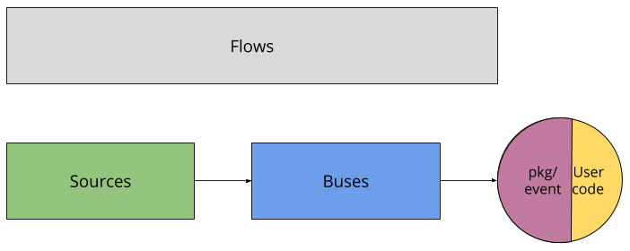

# eventing

备注：内容来自 https://github.com/knative/docs/tree/master/eventing

eventing是Knative事件绑定和发送的开源规范和实现。

eventing是一个正在进行中的事件系统，旨在满足云原生开发的常见需求：

1. 服务在开发期间松散耦合并独立部署
2. 生产者可以在消费者收听之前生成事件，并且消费者可以表达对尚未生成的事件或事件类别的兴趣。
3. 可以连接服务以创建新的应用程序
   - 无需修改生产者或消费者，而且
   - 能够从特定的生产者中选择特定的事件子集。

上述问题与CloudEvents的设计目标是一致的，CloudEvents是由CNCF serverless工作组开发的跨服务互操作性的通用规范。

## 架构

为了细分问题，我们将服务器端组件拆分为三个抽象：

### Bus/总线

总线通过NATS或Kafka等消息总线提供k8s原生抽象。在这个层面上，抽象基本上是发布-订阅; 事件发布到Channel，订阅将该Channel路由到感兴趣的各方。

- **Channel**是网络终端，它使用特定于总线的实现来接收（并可选地持久化）事件。
- **Subscription**将在channel上收到的事件连接到感兴趣的目标，表示为DNS名称。单个频道上可能有多个订阅。
- **Bus**定义了使用特定持久化策略（例如将事件传递到Kafka topic）实现channel和subscription所需的适配层。

我们目前实现了3个Bus：

- Stub 提供无依赖的内存传输
- Kafka 使用现有（用户提供的）Kafka集群来实现持久性。
- GCP PubSub 使用Google Cloud PubSub来实现消息持久性。

### Source

Source提供了类似的抽象层，用于从外部Kubernetes提供数据源并将它们路由到集群，表示为Feed（通常，表示总线上的channel，但也可以直接指向另一个端点）。目前，我们只有一些通用的Source，但我们计划随着时间的推移添加更多有趣和具体的Source。

- **Feed**是一个原始对象，用于定义EventType和操作之间的连接（作为兼容CloudEvents的HTTP端点）。
- **EventType**和**ClusterEventType**描述了一组具有由EventSource发出的通用模式的特定事件。EventType是有命名空间范围的，而ClusterEventTypes由管理员安装，并且可在群集中的所有命名空间中使用。
- **EventSource**和**ClusterEventSource**描述了可能产生一个或多个EventTypes的外部系统。

我们目前实现了3个Source：

- K8sevents 收集Kubernetes Events并将它们呈现为CloudEvents。
- GitHub 收集 pull request 通知并将其表示为CloudEvents。
- GCP PubSub 收集发布到 GCP PubSub topic的事件，并将它们表示为CloudEvents。

### Flows

最后，我们有一个名为Flow的更高级抽象，它将从Source到端点的规范捆绑起来，选择性的允许您选择事件路由的Channel和Bus。（当然，有一个默认的Bus用于配置Channel。）

- **Flow**是Eventing中面向用户的顶级概念; 它描述了从外部事件Source到将对事件做出反应的目标的所需路径。只有一种类型的Flow，由核心 Knative Eventing install 安装。