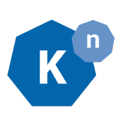

Knative介绍
================

## 什么是knative？

[knative](https://github.com/knative) 是谷歌牵头的 serverless 架构方案，旨在提供一套简单易用的 serverless 开源方案，把 serverless 标准化和平台化。目前参与 knative 项目的公司主要有： Google、Pivotal、IBM、Red Hat和SAP。

这是 Google Cloud Platform 宣布 knative 时给出的介绍：

> Developed in close partnership with Pivotal, IBM, Red Hat, and SAP, Knative pushes Kubernetes-based computing forward by providing the building blocks you need to build and deploy modern, container-based serverless applications.
>
> 与Pivotal，IBM，Red Hat和SAP密切合作开发，通过提供构建和部署基于容器的现代serverless应用程序所需的构建块，Knative推动基于Kubernetes的计算。

在knative的github页面，Knative 给出的官方介绍如下：

>  Kubernetes-based platform to build, deploy, and manage modern serverless workloads.
>
>  基于Kubernetes的平台，用于构建，部署和管理现代serverless工作负载。

## knative项目进展

knative在2018年7月24日对外发布，当前还处于早起发展的阶段。

- 2018-07-19 v0.1.0 版本发布
- 2018-08-14 v0.1.1 版本发布

## Knative概述

> 以下内容翻译自：https://github.com/knative/docs

Knative扩展了Kubernetes，提供了一组中间件组件，这些组件对于构建可在任何地方运行的现代，以源为中心和基于容器的应用程序至关重要：在本地，在云中，甚至在第三方数据中心。

Knative项目下的每个组件都尝试识别常见模式并编纂最佳实践，这些最佳实践被真实世界中基于Kubernetes的成功框架和应用程序共享。 Knative组件专注于解决许多平凡但困难的任务，例如：

- 部署容器
- 在Kubernetes上编排source-to-URL的工作流程
- 使用蓝绿部署路由和管理流量
- 根据需求自动收缩和调整工作负载大小
- 将运行服务绑定到事件生态系统

Knative的开发人员可以使用熟悉的习语，语言和框架来部署任何工作负载：函数，应用程序或容器。

### 组件

目前有以下Knative组件：

- Build - 源到容器的构建编排
- Eventing - 管理和交付事件
- Serving - 请求驱动的计算，可以扩展到零

### 受众

Knative的设计考虑了不同的角色：

- 开发人员

  Knative组件为开发人员提供Kubernetes原生API，用于将serverless风格的函数，应用程序和容器部署到自动伸缩运行时。

- 运维

  Knative组件旨在集成到更加优雅的产品中，云服务提供商或大型企业的内部团队可以随后运维。

  任何企业或云提供商都可以将Knative组件应用到他们自己的系统中，并将这些收益传递给他们的客户。

- 贡献者

  凭借明确的项目范围，轻量级治理模型以及可插拔组件之间简洁的分离线，Knative项目建立了高效的贡献者工作流程。

  Knative是一个多元化，开放和包容的社区。

## knative特性

> 以下内容翻译自：https://cloud.google.com/knative/

- 所有人必备的基本原语

  Knative提供了一组中间件组件，这些组件对于构建可在任何地方运行的现代，以源为中心和基于容器的应用程序至关重要：在本地，在云中，甚至在第三方数据中心。 Knative组件基于Kubernetes构建，并编写最佳实践，这些最佳实践被真实世界中基于Kubernetes的成功框架和应用程序共享。它使开发人员能够专注于编写有趣的代码，而无需担心构建，部署和管理应用程序的“枯燥但困难”的部分。

- 开发人员友好的软件

	Knative提供了一组可重用的组件，专注于解决许多平凡但困难的任务，例如编排源到容器工作流，在部署期间路由和管理流量，自动伸缩工作负载或将运行中的服务绑定到事件生态系统。 开发人员甚至可以使用熟悉的习语，语言和框架来部署任何工作负载：函数，应用程序或容器。

- 支持流行的开发模式

	Knative专注于惯用的开发人员体验。 它支持常见的开发模式，如GitOps，DockerOps，ManualOps，以及Django，Ruby on Rails，Spring等工具和框架。

- 两全其美：灵活性和控制力

  Knative旨在轻松插入现有的构建和CI / CD工具链。 通过专注于开源优先技术，这些技术可以在任何地方，任何云上，在Kubernetes支持的任何基础架构上运行，企业可以随时随地移动工作负载。 这为客户根据自己独特的要求调整系统提供了所需的灵活性和控制。

- 运维友好

	Knative旨在由所有主要云提供商作为服务运行。 Google目前与Pivotal，SAP，Red Hat，IBM等行业领导者合作，共同打造最适合开发人员需求的构建模块。 Knative为实际工作负载提供动力，并且与Kubernetes和Istio等其他尖端技术兼容。

- 在Kubernetes Engine上运行severless工作负载

	您现在可以通过启用serverless加载项来在Google Kubernetes Engine（GKE）上运行serverless工作负载。serverless的附加组件由Knative提供支持，可帮助开发人员通过单击即可协调构建，服务和事件，从而通过GKE的灵活性和控制来实现惯用的开发人员体验。

## knative分析

和已有的FaaS/serverless实现不同，knative在产品规划和设计理念上有带来新东西：

- 工作负载类型

  和标准化的 FaaS 不同，knative 期望能够运行所有的 workload :

  - traditional application
  - function
  - container

- knative 建立在 kubernetes 和 istio 之上

  使用 kubernetes 提供的容器管理能力（deployment、replicaset、和 pods等），以及 istio 提供的网络管理功能（ingress、LB、dynamic route等）。

  需要特别强调的是：**knative 是 Kubernetes-based！** 或者说 Kubernetes-only，仅仅运行于k8s平台。

- knative 不是一个serverless实现(implement)，而是一个serverless平台(platform)

